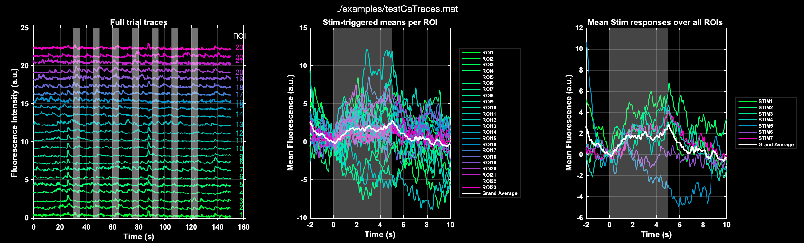
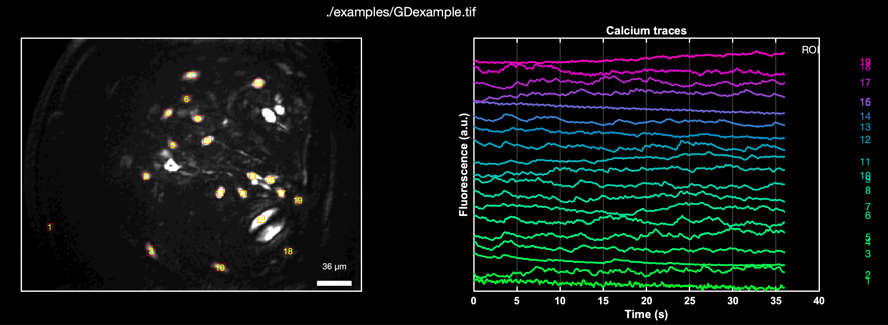
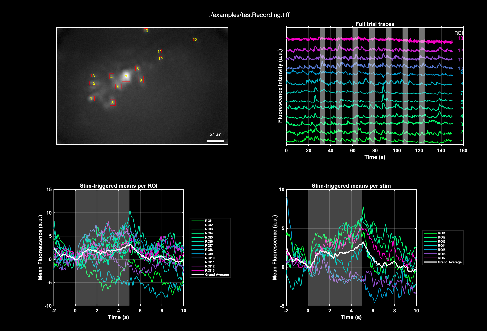

# nRIM_CaImageExplorer
A straightforward set of MATLAB tools for quick visualization and basic analysis of calcium imaging data, meant for nRIM members.

Besides helping out to get quick insights from imaging data, the purpose of this repository is to explore and experiment on ways to make code and repository easily understood, maintained and modified. It tries to maintain consistency of convention, and incorporate mindful (intentional) programming principles.


## Table of Contents
- [nRIM\_CaImageExplorer](#nrim_caimageexplorer)
  - [Table of Contents](#table-of-contents)
  - [Introduction](#introduction)
  - [Getting Started](#getting-started)
  - [Prerequisites](#prerequisites)
  - [Installation](#installation)
  - [Core functions](#core-functions)
  - [Utility Functions](#utility-functions)
  - [Examples](#examples)
  - [To-Do List](#to-do-list)
  - [Contributing](#contributing)
  - [Code of Conduct](#code-of-conduct)
  - [License](#license)
  - [Credits](#credits)
  - [Citation](#citation)

## Introduction
nRIM_CaImageExplorer facilitates both quick visualizations of calcium imaging recordings and basic analyses. It now includes functionalities for extracting calcium traces directly from TIFF stacks and plotting these traces, with or without stimulation data. This repository aims to provide a foundation for future expansion and collaboration within the nRIM community.

The toolkit now supports two primary use cases:

Visualization from Pre-Extracted Traces: Visualizing and analyzing calcium trace data from previously extracted files (e.g., .mat, .csv).
Trace Extraction and Visualization from TIFF Stacks: Direct extraction of calcium traces from TIFF stacks of calcium recordings, followed by visualization and basic analysis.


Note: This code is intended for quick visualizations and basic analyses, not for publication-quality figures.


## Getting Started
At the moment there is code to provide a simple visualization of calcium image recordings, indicating times of stimulation. Later I will add functionality for simple Ca-trace extraction from TIFF files.
Before using nRIM_CaImageExplorer, ensure you have MATLAB (version 2019a or newer) installed with the following toolboxes:
- Image Processing Toolbox
- Signal Processing Toolbox
- Statistics and Machine Learning Toolbox

Note: This list is not exhaustive and should be updated based on the actual toolboxes used by nRIM_CaImageExplorer.

## Installation

To use nRIM_CaImageExplorer, follow these steps:

1. Clone or download this repository to your local machine.
2. Open MATLAB.
3. Navigate to the directory where you saved the repository.
4. Add the repository to your MATLAB path. You can do this by running the following command in the MATLAB Command Window:

   ```matlab
   addpath(genpath('path_to_nRIM_CaImageExplorer'));
   ```
   (Replace path_to_nRIM_CaImageExplorer with the actual path to the folder where you saved the repository.)
   
5. Save the path for future MATLAB sessions:
  ```matlab
   savepath;
   ```


## Core functions
(... denotes additional optional parameters))

- `showExtractedTracesFromCaRecording(filename, framerate, ...)`: Creates a figure with both raw calcium traces and their triggered averages, given a file with trace data.
- `showCaTracesFromCaRecording(filename, framerate, ...)`: processes a calcium imaging TIFF file to extract and visualize calcium traces.
- `thresholdImageForSomataDetection(image, somaDiameterPixels, sensitivity)`: simple thresholding of a std-projection of ca-recording. Adjust the values for better results
- `cleanBinaryImageForCellDetection(binaryImage, minSomaDiameterPixels)` : morphological cleaning of thresholding. 
- `plotCaTracesFromROIdata(traceData, framerate, ...)`: Plots calcium imaging traces for a given ROI data set.
- `extractTriggeredWindows(traceData, stimTimes, stimDuration, preWin, postWin, framerate)`: Extract windows of trace data around stimulation times.
- `plotCaTracesWithStim(traceData, framerate, ...)`: Plots calcium traces with overlaid stimulation periods, if provided.
- `plotMeanTriggeredWindows(triggeredWindows, preWin, postWin, stimDuration, framerate)`: Plots the mean activity across all regions of interest (ROIs) for specified pre- and post-stimulation windows.


## Utility Functions


- `readTraceData(filename, ...)`: Reads calcium imaging trace data from a file (supports .mat and .csv formats).
- `validateTraceData(traces)`: Validates the integrity and format of the trace data, ensuring it meets expected dimensions and types.

- `sec2frames(seconds, framerate)`: Converts a time value from seconds to frames based on the given framerate.
- `frames2sec(frames, framerate)`: Converts a frame count to seconds based on the given framerate.
- `makeXAxisFromFrames(numFrames, framerate, unit)`: Generates an x-axis for plotting based on the number of frames and the framerate.
- `generateCustomColormap(numColors)`: Creates a custom colormap for differentiating multiple traces in a plot.
- `drawStimulationRectangle(axesHandle, stimTime, stimDuration, yLimits)`: Adds a rectangle to the plot to indicate the period of stimulation.
- `applyCustomFigureStyle(figHandle, axesHandle)`: Applies a custom style to the figure and axes to maintain consistency in the visual appearance of plots.


## Examples


Here's how you can visualize a extracted traces recording with stimulation events:

```matlab
showExtractedTracesFromCaRecording('example_data.mat', 20, 'stimTimes', [30 45 60 75 90 105 120], 'stimDuration', 5, 'preWin', 2, 'postWin', 5);
```
To process all recordings in a folder:
```matlab
showExtractedTracesFromCaRecordingsInFolder('./examples/', 20, 'stimTimes', [30 45 60 75 90 105 120], 'stimDuration', 5, 'preWin', 2, 'postWin', 5);
```



Here's how you can visualize Ca recording image data recording without stimulation:

```matlab

showCaTracesFromRecording('example_data.tiff', 1.2, 20, 20,  'sensitivity', 0.001);


```
To visualize Ca recording image data with stimulation:
```matlab
showCaTracesFromRecording('example_data.tiff', 1.2, 20, 20,  'sensitivity', 0.001, 'stimTimes', [30 45 60 75 90 105 120], 'stimDuration', 5, 'preWin', 2, 'postWin', 5);
```




## To-Do List

- [ ] Add more flexibility in the plotting, e.g. multiple stimulation types in a trial
- [ ] Add functionality to deal with multiple trials in a batch (e.g. for averaging)


## Contributing
(Outline the process for contributing to the repository. This could include how to submit issues and pull requests, and any coding standards or tests contributors need to follow. Link to a CONTRIBUTING.md file if you have one.)

## Code of Conduct
(If applicable, link to the CODE_OF_CONDUCT.md file or section. This is important for fostering a positive community.)

## License
(State the type of software license this repository is under. Link to the LICENSE file.)

## Credits
(Acknowledge any individuals or organizations that contributed to the development of the software.)

## Citation
(If this software is associated with any publications or has a preferred citation format, include those details here.)
